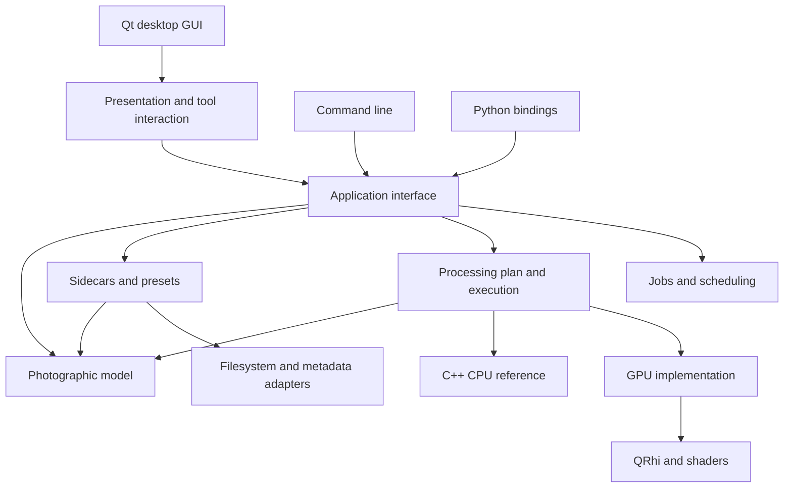

# arraw reimplementation plan

Status: adopted direction, summarising the architecture conversation of
2026-09-17 and the review of the same day. This document proposes a ground-up
design; it does not describe the current implementation.

> My note: Written by Astra and reviewed by Claude Opus.

The route was settled after that review: a ground-up rebuild along the phases in
§19, rather than converging the existing code on the same target architecture by
extraction. The rebuild's cost, its rollback position, and the policy for the
shipped application while it proceeds are recorded in
[§19](#cost-rollback-and-the-shipped-application) and are part of that decision.

> **Review note (2026-09-17).** Paragraphs marked this way were added by a
> review of the plan against the current source. They record findings verified
> by inspection, corrections to claims the code contradicts, and gaps the plan
> did not cover. They are commentary, not part of the original proposal, and can
> be stripped when this document decomposes into ADRs.

## 1. Purpose and authority

Build arraw as a reusable photographic development library with three callers:
the desktop GUI, the command line, and standalone Python. Complete photographic
operations should be available through the library, with minimal dependence on
widgets and one consistent meaning across callers.

The feature baseline is
[arraw for photographers](docs/arraw-for-photographers.md). Its scope is more or
less binding: architecture work should preserve those capabilities and the
folder-based, non-destructive workflow. Any proposed feature removal or material
behaviour change needs a separate discussion.

Other documents retain their existing responsibilities:

- [CONTEXT.md](CONTEXT.md) remains the authoritative domain vocabulary. This plan
  uses its terms without creating a second glossary.
- [DESIGN.md](DESIGN.md) describes the existing implementation and pixel pipeline.
- [Architecture Decision Records](docs/adr/README.md) explain existing decisions.
- [Code guidelines](docs/code_guidelines.md) govern implementation style.
- [Keybindings](docs/keybindings.md) record the current desktop interactions.

Names such as `PhotoDocument`, `EditSession`, and `ProcessingPlan` below are
provisional architectural type names, not adopted additions to the domain
glossary. Define any new domain concepts in CONTEXT.md when adopting them.

This plan is not an ADR. Before or alongside implementation, record the adopted
decisions about formats, dependencies, threading, and processing compatibility.
Supersede existing ADRs where necessary; preserve their historical reasoning.

> **Review note (2026-09-17): where this document lives.** It is currently
> untracked at the repository root, which is the one place the documentation
> discipline does not have: CONTEXT.md, DESIGN.md and `docs/adr/` each own a job,
> and a permanent root-level plan is the junk drawer they exist to avoid. Treat
> this as a working artifact that decomposes into ADRs from 0058 onwards — the
> CPU reference superseding
> [ADR 0002](docs/adr/0002-shader-adjustments-cpu-encode.md), the verification and
> CI posture, the reference-frame model, the Python packaging and lifecycle, and
> the processing-version compatibility policy — with DESIGN.md rewritten as each
> phase lands. The one decision that has no natural ADR home, the rebuild itself,
> arguably deserves one anyway, since nothing is harder to reverse.

## 2. Requirements and the outcome of the discussion

### Firm requirements and stated preferences

1. Preserve the photographic scope of the feature brief: open, cull, develop,
   repeat settings across photos, and export, without a catalogue or import step.
2. Make most photographic operations available through both GUI and CLI.
3. Support standalone Python scripts, notebooks, and batch processing as a
   first-class use case.
4. Treat scripting an already-open GUI as a possible later extension.
5. Provide an ordinary C++ CPU implementation as a reference, alongside shader
   implementations for GPU execution.
6. Keep widget dependence small and restricted to presentation.
7. Qt without Widgets is acceptable for the CLI and shared infrastructure.

The CPU reference should be complete enough to serve as a usable rendering
backend, not only a collection of test functions. That provides a route to CPU
rendering on machines without a GPU or display server.

### Recommended direction, still subject to detailed design

- A modular monolith, implemented primarily in C++20, with ordinary in-process
  calls between modules.
- A typed photographic model and a public library interface that hides widget,
  graphics-resource, and event-loop details.
- Shared editing, persistence, batch, and export operations beneath all callers.
- Ordinary C++ value types and algorithms at the numerical core; Qt Core allowed
  in application infrastructure and persistence where useful.
- QRhi and Qt Shader Tools retained as the first GPU implementation.
- Pybind11 and scikit-build-core for a native Python package.
- One processing contract, with a readable CPU reference and GPU implementations
  verified against it.

### Earlier proposals that are no longer requirements

Two recommendations changed during discussion and should not accidentally
reappear as settled constraints:

- **A completely Qt-free build of the whole CPU library is not required.** The
  important acceptance criterion is standalone CPU use without graphics
  initialization, a display server, or a user-managed Qt event loop. Qt Core may
  be a dependency.
- **The shader need not remain the sole implementation of adjustment math.** The
  desired CPU reference deliberately changes that rule. Shared orchestration,
  parameters, preparation, and rigorous comparisons must keep both backends
  aligned.

Consequently, adding a replacement JSON library, threading framework, or image-I/O
framework is not automatically necessary merely to remove Qt.

## 3. What the existing code teaches us

The current implementation already contains useful foundations:

- The `arraw_engine`, `arraw_ui`, and `arraw_cli` build targets separate Widgets
  from much of the engine.
- `RendererCore` and offscreen rendering centralise the shader execution path.
- Develop Groups, parameter descriptions, partial presets, and sidecar ownership
  rules express substantial domain knowledge.
- Pure geometry and image-processing helpers already exist.
- Tests cover numerical behaviour, persistence, CLI behaviour, and GPU output.

The main architectural gap is ownership of complete operations. Reusable pixel
functions alone do not make the application a reusable library.

| Existing code | Architectural pressure |
|---|---|
| [DevelopSession](src/DevelopSession.h) | Owns document state, decoded pixels, derived buffers, and dirty baselines together. |
| [MainWindow](src/MainWindow.cpp) | Coordinates loading, History, persistence, batch operations, and export as well as presentation. |
| [ImageViewport](src/ui/ImageViewport.h) | Combines graphics integration, input gestures, tool state, sampling, and export entry points. |
| [FilmStrip](src/ui/FilmStrip.cpp) | Performs culling sidecar writes inside a widget. |
| [FieldSpec](src/develop/FieldSpec.h) | Defines numerical behaviour partly in terms of integer slider ticks. |
| [CLI preset operations](src/cli/PresetCommand.cpp) | Repeat application orchestration also present in the GUI. |
| [Build configuration](CMakeLists.txt) | Exposes the engine source tree and graphics dependencies broadly; CPU-only consumers cannot select a narrow dependency set. |

A specific source-level example illustrates the risk. CLI export and single-image
GUI export obtain the lens-corrected, spotted buffer through `DevelopSession`.
GUI batch export constructs its own sequence and applies Spots directly to the
decoded buffer, omitting Lens Corrections.

> **Review note (2026-09-17).** Confirmed by inspection.
> [`MainWindow.cpp:2510-2542`](src/MainWindow.cpp) calls `decodeImage()` and then
> `applySpots()` on `loaded.fullRes` directly. `applyLensCorrection` is called
> from exactly one place,
> [`DevelopSession.cpp:224-257`](src/DevelopSession.cpp), and
> [`ExportCommand.cpp:55`](src/cli/ExportCommand.cpp) routes through
> `DevelopSession` with a comment saying why. Batch export therefore drops
> distortion, vignetting and CA correction, and the sensor-clip buffer with them.
> It is a live data-quality defect in the shipped application, so it should be
> fixed in the current code with a regression test rather than held as motivation
> for the duration of the rebuild — the rebuild does not reach batch export until
> Phase 4.
>
> [DESIGN.md](DESIGN.md) lines 191-193 describe `decodeImage()` as running
> "full libraw decode → normalizeExposure → lens corrections → spots →
> downsample2x". It does not: it dispatches to `RawProcessor::load` or
> `StandardImageLoader::load`, and the corrections and spots happen later in
> `DevelopSession`. That inaccurate description is a plausible route by which the
> defect was written, and is worth correcting in the same change.

Some documentation and source descriptions also disagree about coordinate frames.
The glossary describes composition anchoring for parametric Masks, whereas
[LocalAdjustment.h](src/develop/LocalAdjustment.h) describes image-relative
geometry. [Spot.h](src/develop/Spot.h) stores buffer-pixel positions while parts of
the documentation describe normalised coordinates. Reimplementation must resolve
the intended behaviour explicitly instead of copying inconsistent descriptions.

> **Review note (2026-09-17).** The Mask half of that disagreement is not an open
> design question — the code is unambiguous and self-consistent, and the glossary
> is simply wrong. [`image.vert:88-89`](shaders/image.vert) exports `vImageUV`
> before the coarse-Orientation remap; [`image.frag:709`](shaders/image.frag)
> evaluates parametric Masks at that coordinate, so Crop and Straighten do not
> slide a Mask off its subject; and `rotateMaskQuarterTurns` / `flipMask`
> ([`LocalAdjustment.h:106-111`](src/develop/LocalAdjustment.h), wired at
> [`MainWindow.cpp:360`](src/MainWindow.cpp) — "masks rotate/mirror with the
> subject") rewrite the geometry when Orientation changes. All three Mask Types
> are content-anchored. [CONTEXT.md](CONTEXT.md) lines 351-353 and the Brush Mask
> entry at 357-358 assert the opposite for Linear and Radial and should be
> corrected in the current repository, independently of this plan.
>
> The `Spot.h` frame mismatch stands as described and is genuinely open.

Starting from zero permits new ownership and interfaces. It does not require
discarding verified algorithms, fixtures, compatibility cases, or photographic
knowledge from the current code.

## 4. Overall architecture

Use a local modular monolith. The public interface exposes useful photographic
operations; internal modules hide decoding, persistence, job scheduling, and
rendering coordination.



The organising principle is a deep module: substantial behaviour behind a small,
coherent interface. A caller requesting export should not need to know how to
load sidecars, resolve Demosaic Algorithm, apply Lens Corrections, upload textures,
or embed metadata in the correct order.

### Public interfaces

Expose typed state, meaningful operations, structured failures, and explicit
lifetime rules. Hide `QWidget`, `QRhi`, GPU handles, and implementation-specific
buffer types from the ordinary library interface.

Prefer ordinary C++ values at the public seam to make Python bindings and other
native callers straightforward. Using Qt internally is acceptable. Public
`QObject` inheritance and queued-signal protocols should not be prerequisites for
using photographic operations.

### Real seams

Useful seams exist where requirements already vary:

- CPU and GPU processing.
- GUI, CLI, and Python presentation of the same operations.
- Interactive preview and export scheduling.
- File persistence and in-memory editing.
- Camera decoding and subsequent development.

Do not introduce an abstract interface for every class. Internal implementation
details can remain concrete until there is a real variation to support.

## 5. State, ownership, and lifetime

Separate persisted photographic state from editing interaction and disposable
processing resources.

| Proposed representation | Responsibility | Lifetime |
|---|---|---|
| `Shot` | References the primary and companion files according to the existing Shot rules. | Folder discovery and navigation. |
| `PhotoDocument` | Develop state, User Metadata, Snapshots, source reference, and persistence baseline. | Open document; durable portions map to the sidecar. |
| `DevelopState` | Complete typed develop values, including per-image state. | Immutable revision or editable transaction value. |
| `EditSession` | Current document revision, History, provisional edits, dirty state. | Editing session. |
| `ViewState` | Zoom, pan, selected tool/Mask, overlays, Soft-proofing, display configuration. | View and preferences. |
| Processing resources | Decoded buffers, intermediate images, textures, compiled pipelines, caches. | Disposable, with explicit budgets. |

Opening a document should not require full RAW decoding. Culling, parameter
inspection, metadata edits, and preset application should work without allocating
full-resolution pixels. Some operations need lightweight source metadata to
resolve orientation, dimensions, and defaults; laziness must not mean using
incorrect defaults until decoding happens.

`DevelopState` should contain typed substructures organised around the existing
Develop Groups. It should preserve the rules for which values travel through
presets and Copy/Paste Settings. Per-image Local Adjustments, Spots, and the Grain
seed retain their existing treatment.

Large Brush Mask rasters should use immutable shared storage or equivalent
copy-on-write techniques. A new History revision must not copy an entire raster
unless its contents actually change.

Give editable list entries such as Local Adjustments and Snapshots stable
identifiers. A Python reference to a Mask must not silently refer to a different
Mask after an insertion or reorder.

Keep separate baselines for develop state, User Metadata, and persisted Snapshot
management as needed. A metadata write must not accidentally mark unrelated
unsaved develop changes as saved.

## 6. Editing operations and History

The library owns the meaning of an edit. Representative operations include:

```text
open_document(source)
set_parameters(changes)
apply_preset(preset)
apply_groups(source_state, groups)
add_local_adjustment(mask, deltas)
paint_brush_stroke(mask_id, stroke)
set_crop(crop)
set_orientation(orientation)
set_user_metadata(changes)
create_snapshot(name)
restore_snapshot(snapshot_id)
undo()
redo()
save()
export(request)
```

These are conceptual operations, not a frozen list of C++ methods. Scalar
parameter setters can be generic; compound edits need operations that enforce
their invariants together.

For example, changing Orientation may require updating Crop and Mask geometry.
Callers should request that operation rather than duplicating the necessary
sequence of field assignments.

### Edit transactions

Use an explicit interaction lifecycle:

```text
begin edit -> update provisional state -> commit one History step
                                    \-> cancel provisional changes
```

A slider drag, brush stroke, Snapshot restore, preset application, or Python block
can produce one coherent History step. Rendering may consume provisional state
for live feedback before the step is committed.

Transaction failure or cancellation must leave a defined state. A Python exception
inside an edit block should cancel that provisional transaction. This does not
make filesystem writes or multi-file batches atomic.

Preserve the existing distinctions between develop History and immediate User
Metadata changes. Snapshot restoration is a develop edit; managing the Snapshot
list has its own persistence policy.

### Notifications and concurrency

Publish changes with document identity and revision. Observers receive a coherent
state and meaningful changed-field information, allowing the GUI to update only
affected controls and previews.

Serialise mutations for each session. Concurrent callers should either submit
operations to that owner or supply an expected revision and receive a conflict.
The exact execution mechanism remains to be selected; it should not expose
internal locks or Qt thread affinity to Python callers.

History is session state, not a persisted event-sourcing database. Batch undo,
especially when it writes several sidecars, requires a separate policy for
partial failures and external edits.

## 7. Parameters and shared validation

Build on the current `DevelopParameter`, `DevelopGroup`, and `FieldSpec` ideas,
while separating photographic values from controls.

An authoritative parameter description should identify:

- Stable machine key and value type.
- Units, allowed range, and default.
- Develop Group membership.
- Applicability, such as RAW-only or treatment-dependent behaviour.
- Validation and persistence mappings.
- Processing stages affected by changes.

Slider tick ranges, display precision, and localised text are presentation
descriptions derived from that model. Exposure is passed in its domain units;
the GUI decides how to represent it with a slider.

The same validation must serve CLI, Python, GUI, and persisted inputs. Define
whether invalid external values are rejected, normalised, or retained with a
warning. Do not let each front end make that decision independently.

The descriptors should assist ordinary controls and structured interfaces.
Tone Curves, Crop, and Mask editing still warrant dedicated interfaces rather
than being reduced to an untyped property bag.

GPU uniform layouts are separate from domain descriptors. Generate or
mechanically verify the C++/shader layouts so fields cannot silently differ
between vertex shaders, fragment shaders, and host structures.

## 8. Geometry and reference frames

Geometry needs one explicit model shared by rendering, tools, sampling, and
export sizing.

Use distinct types for positions and regions in relevant frames, for example:

```cpp
DecodedBufferPoint source;
CorrectedImagePoint subject;
OrientedImagePoint upright;
CropRect crop;
ViewportPoint cursor;
```

The final names and storage units are design choices. The requirement is that a
function accepting corrected-image pixels cannot accidentally receive viewport
pixels or normalised Crop coordinates.

Record for every geometric operation:

- Input and output reference frames and dimensions.
- Pixel-centre and edge conventions.
- Coordinate units and axis directions.
- Interpolation and out-of-bounds behaviour.
- How it behaves at preview resolution and in export.

CPU and GPU execution should consume the same transform descriptions and
coefficients. Lens Distortion may be nonlinear; it must not be forced into an
affine-matrix abstraction merely because simpler geometry uses matrices.

Resolve these visible behaviours before implementing the new model:

1. Intended anchoring of Linear and Radial Masks under Crop, Rotation, and
   Orientation, given the current documentation/source disagreement.
   *(Settled by the review: the current behaviour is content anchoring for all
   three Mask Types, implemented consistently across shader and CPU — see the
   review note in §3. What remains is to carry that behaviour forward
   deliberately rather than by accident, and to fix the glossary.)*
2. How Brush Masks and Spots behave when Lens Corrections change the corrected
   image coordinates beneath them.
3. How source dimensions, camera default Crop, and user Crop interact.
4. How copying Geometry between different aspect ratios is defined.

Once chosen, document examples and test transforms in both directions. Include
non-square images, mirrored orientations, odd dimensions, and edge coordinates.

## 9. Processing contract and execution plan

Define one versioned processing contract. Both CPU and GPU implementations execute
that contract, while the application layer chooses requested output and quality.

A render request should identify:

```text
source identity and revision
develop state and revision
processing version
requested region and resolution
quality policy
output purpose and colour configuration
```

The processing module resolves decode requirements, Lens Corrections, Spots,
prepared LUTs, image passes, and output conversion. Callers never assemble these
steps themselves.

### Pipeline order

Use the existing [processing pipeline](DESIGN.md#processing-pipeline-full-order)
and [shader](shaders/image.frag) as evidence for the initial behaviour. Freeze the
chosen baseline with tests before rearranging it. In particular, UI panel order
is not processing order.

The current broad sequence is RAW/standard decode and preparation; Lens
Corrections and Spots; Noise Reduction and spatial context; geometry sampling;
the ordered tone/colour/local/effects development; and destination-specific
display or export processing. The detailed sequence belongs in the authoritative
pipeline specification, not in independently maintained caller recipes.

> **Review note (2026-09-17).** Say what makes that specification authoritative,
> or it becomes a fourth artifact to drift against. Today `shaders/image.frag` is
> the source of truth and
> [DESIGN.md § Processing Pipeline](DESIGN.md#processing-pipeline-full-order) is
> hand-synchronised to it, with AGENTS.md carrying the rule that keeps them
> together. The plan replaces that pair with a specification, a CPU
> implementation, and a GPU implementation — three things where there were two,
> and the one that no longer executes is the one declared authoritative. Prefer
> an executable specification: the stage list, its dependencies, and its
> invalidation rules as data in code that both backends iterate and that the
> DESIGN.md table is generated from. Otherwise the drift diagnosed in §3 simply
> acquires a new home.

Defaults and baseline rendering require care. Default develop values need not
mean an identity transform: Filmic Highlights has a nonzero default, and current
RAW preparation and base-look behaviour affect appearance. Represent the chosen
behaviour explicitly in the processing contract.

### Internal graph, fixed photographic meaning

The implementation can use a dependency graph because preview, histograms,
sampling, and export consume different results. The product does not need a
user-editable node graph or arbitrary effect ordering.

Changes should invalidate only their descendants:

| Change | Expected invalidation |
|---|---|
| Exposure | Affected development stages and later outputs; retain decode and Lens Corrections. |
| Demosaic Algorithm | Decode and all dependent image stages. |
| Lens Correction toggle | Relevant corrected buffers and downstream stages. |
| Monitor profile | Display transform and displayed output. |
| Rating | Metadata/presentation state; no photographic pixel stages. |
| Brush stroke | Relevant Mask resources and downstream developed output. |

Cache keys need source identity, relevant parameters, processing version, region,
resolution, and applicable profile/quality information. Persistent caches also
need a strategy for changes to external profiles and library-dependent processing.

### Outputs and preview quality

Expose histogram inputs and White Balance sampling as named processing outputs.
They should be available without constructing a viewport and should derive from
the correct processing stage.

Separate interactive preview quality from final quality. Reduced-resolution
neighbourhood processing can be approximate. A full-quality preview and export
must agree on development when compared at equivalent sampling and before their
different destination transforms.

Sharpening requires an explicit product decision: currently it is export-only.
Choose whether to preserve it as output sharpening with a corresponding preview,
or introduce a common develop-sharpening stage. Do not silently promise exact
preview/export equivalence while retaining unpreviewed processing.

## 10. C++ reference and GPU implementation

### CPU reference

Implement all photographic processing in ordinary C++ with clear, inspectable
functions and intermediate results. Use it for correctness tests, debugging, and
production CPU rendering from CLI and Python.

> **Review note (2026-09-17): the size of the port, and its standing cost.**
> The port is smaller than "implement all photographic processing" suggests,
> because much of the pipeline is already CPU code that transfers directly: the
> Basic Tone LUT atlas (ADR 0033), the tone-curve LUT, the white-balance gains
> (ADR 0025), the display/proofing LUT via lcms2, Lens Corrections, Spots,
> `downsample2x`, the output transform, sharpening, and metadata embedding. What
> is GPU-only is `shaders/image.frag` (753 lines) plus the noise-reduction and
> blur pre-passes (~300 lines more). Scoping Phase 3 and Phase 4 against that
> number is more useful than against the pipeline as a whole.
>
> The standing cost is the part to state plainly, because it is permanent and
> paid by every future feature. Adding one adjustment today already touches seven
> places (see AGENTS.md § Adding a new adjustment); under this plan it touches
> those plus a second implementation and its tolerance tests. Acceptance
> criterion 9 concedes this in the phrase "the appropriate backend
> implementations". Accept it explicitly, in the ADR that supersedes
> [ADR 0002](docs/adr/0002-shader-adjustments-cpu-encode.md), rather than
> discovering it at the fifteenth adjustment.

Float32 is the proposed baseline for comparisons with shader arithmetic. Selected
mathematical tests may use higher precision. Explicitly define behaviour for
negative working values, Recoverable Headroom, nonfinite inputs, and degenerate
geometry.

Optimise only after establishing behaviour. Multithreading and SIMD are compatible
with a readable reference if the contract and comparison tests remain intact.
No promise is made that full-resolution CPU processing will meet GPU preview
latency; reduced-resolution CPU previews and slower final renders are acceptable
starting points.

### GPU implementation

Implement accelerated equivalents behind the same rendering interface. Share
parameter validation, preparation, transforms, LUT data, filter coefficients,
seeds, and orchestration wherever possible.

Logical stages need not become separate physical passes. Fuse compatible stages
into a shader when useful. Backend-specific optimisations must preserve the
declared behaviour and quality contract.

Some stages can remain CPU-only in both modes, such as the initial LibRaw decode.
A GPU backend is an accelerated execution strategy for the pipeline; it does not
imply that every stage runs on the GPU.

### Comparison policy

Do not demand universal bitwise equality across hardware. Establish justified
per-stage and end-to-end tolerances, with exact comparisons for discrete values
where appropriate.

Tests must cover:

- Scalar adjustment functions and prepared LUTs.
- Geometric sampling, edge handling, interpolation, and pixel centres.
- Neighbourhood filters and resolution-dependent radii.
- Local Adjustment overlap and ordering.
- Deterministic Grain keyed to coordinates and seed, independent of tile/job order.
- Final linear image output and destination-specific transforms.

Use local and maximum-error checks as well as aggregate metrics. Whole-image
averages can hide a broken Mask or narrow edge artifact. Compare equivalent
resolution and quality; a draft preview is not a final-quality reference.

Backend agreement alone is insufficient. Independent expected values, invariants,
and reviewed reference images must also test whether the shared interpretation is
correct.

### Alternative: common algorithm source

Halide is an example of writing an image algorithm with separate CPU and GPU
execution schedules. It remains an option if paired implementations prove too
costly. It is not the selected starting point: the current preference is readable
C++ alongside shaders, with shared preparation and strong comparisons.

See the [Halide CPU/GPU tutorial](https://halide-lang.org/docs/tutorial/lesson_12_using_the_gpu.html).

> **Review note (2026-09-17).** Halide is not the only alternative to hand-paired
> implementations, and adopting a whole scheduling language is the most expensive
> one. A lighter option is generating both backends from one source: the per-pixel
> stage bodies written once in a restricted subset that emits GLSL and compiles as
> C++, with the surrounding orchestration hand-written on each side. The repository
> already demonstrates both ends of that spectrum — `linearMaskWeight`
> ([`image.frag:569-572`](shaders/image.frag)) is a hand-maintained "line-for-line
> port" of the CPU function held together by golden tests, which works for one
> function and scales poorly to 753 lines; while the LUT-based stages show the
> opposite pattern, where the CPU computes the data and the shader only samples it.
> Widening the LUT-and-prepared-data approach is itself a third option: the more
> stage behaviour lives in CPU-prepared tables, the less there is to implement
> twice. Worth deciding in Phase 3, on the evidence of the first three paired
> stages, rather than left implicit.

## 11. Qt and graphics technologies

These technologies occupy different layers:

| Technology | Role in this proposal |
|---|---|
| Qt Core | Optional shared infrastructure for files, Unicode, settings, JSON, threading, and events. |
| Qt GUI | Graphics and window-system infrastructure used by the QRhi adapter and desktop integration. |
| Qt Widgets | Desktop controls, panels, and windows only. |
| Qt Quick | An alternative presentation system; switching is not part of this plan. |
| QRhi | Portable host-side GPU resource management and command submission. |
| Qt Shader Tools / `qsb` | Build shader variants for supported graphics backends. |
| Vulkan | Cross-platform graphics/compute interface beneath a GPU adapter. |
| Direct3D | Microsoft graphics interface, with distinct 11 and 12 backends. |
| Metal | Apple's native graphics/compute interface. |
| OpenGL | Another graphics backend, used by current arraw on Linux. |

QRhi lets one host implementation target different graphics systems. It has
limited compatibility guarantees, so its types should stay private and supported
Qt versions should be tested. Its Null backend performs no rendering and cannot
serve as the CPU reference. See [QRhi](https://doc.qt.io/qt-6/qrhi.html).

Qt's shader baker accepts Vulkan-style GLSL and produces backend-specific shader
representations. Shader source dialect does not determine the runtime backend;
the same authored shader can run through Metal or Direct3D. This does not generate
the ordinary C++ reference. See the
[QSB manual](https://doc.qt.io/qt-6/qtshadertools-qsb.html).

Fragment shaders can process an image by drawing into an offscreen texture.
Compute shaders provide a different execution model suited to some filters and
reductions. Choose based on algorithm needs and measured behaviour rather than
assuming compute is universally faster.

Vulkan on Apple platforms may use a translation layer such as
[MoltenVK](https://github.com/KhronosGroup/MoltenVK). Retaining QRhi lets arraw use
its native Metal backend instead of requiring that route.

### Headless operation and lifecycle

Distinguish no visible window, no display server, and no GPU. They are different
requirements. CPU processing must work without graphics initialization.

Qt Core is acceptable for that path. `QCoreApplication` supports non-GUI programs;
requiring callers to run an event loop is a separate design choice. See
[QCoreApplication](https://doc.qt.io/qt-6/qcoreapplication.html).

The QRhi adapter needs explicit runtime setup and ownership. The current code
uses `QGuiApplication`; offscreen graphics can still depend on platform plugins.
The OpenGL fallback surface has main-thread creation/destruction constraints even
if GPU work is performed on another thread. See
[QRhi OpenGL initialization](https://doc.qt.io/qt-6/qrhigles2initparams.html).

Select the CLI runtime before constructing its application object. Do not assume
an existing `QCoreApplication` can simply be upgraded to `QGuiApplication` later.
Python embedding must also account for a host that already owns a Qt application.
The GPU embedding policy needs an early prototype; CPU use must remain available
when GPU initialization is unavailable or incompatible with the host.

## 12. Scheduling, memory, and responsiveness

The engine should own job scheduling, cancellation, and resource budgets. GUI
code displays progress; it does not manually assemble decode/render/write loops
or drive nested event loops to make them appear responsive.

### Job contract

A long-running operation returns a job with identity, progress, cancellation,
completion, and a structured result. Provide blocking convenience wrappers for
CLI and Python as well as nonblocking observation for the GUI.

Define cancellation at stage boundaries. Stop scheduling new work promptly;
allow a write to finish safely when interrupting it would leave an invalid file.
Partial batch completion must be reported explicitly.

Jobs must not retain raw pointers to windows. Closing a GUI or Python engine
must have a defined policy for draining/cancelling work and releasing resources.

### Immutable export inputs

Capture the requested develop revision, resolved User Metadata, output options,
and source revision when creating an export job. Editing can continue without
changing that job's meaning.

Specify what happens if the source file changes before lazy decoding occurs:
detect and fail, or explicitly resolve a new request. An immutable settings value
alone does not freeze mutable files on disk.

### Bounded concurrency

Budget CPU memory, GPU memory, decode work, and export work together. A
24-megapixel RGBA32F buffer occupies roughly 384 MB before other intermediates.
Limiting jobs by count alone is insufficient for mixed image sizes.

Account for internal parallelism in dependencies such as LibRaw's OpenMP build;
running many internally parallel jobs can oversubscribe the machine.

Interactive preview should have priority over speculative thumbnail work. Old
results carry their revisions and cannot replace newer results. Cancellation or
supersession should release buffers and reservations predictably.

### GPU ownership and presentation

Give each GPU context a defined owner thread. Separate contexts may use the same
code without sharing resources implicitly. Texture sharing and synchronization
need an explicit design if preview and export use different contexts.

Keep pixels on the GPU across compatible passes and, where possible, through
viewport presentation. Read back for export or requested CPU arrays. Avoid
designs that transfer full-resolution pixels between CPU and GPU on every stage.

### Regions and future tiling

Design requests around regions and resolution levels now. Actual tiled execution
can follow after the first complete implementation. Filters must declare halo
requirements and global dependencies; Dehaze or exposure statistics may need
full-image preparation that naive independent tiles cannot reproduce.

## 13. Python interface

Standalone scripting is required. Python should import a native extension and
use the same application operations as the GUI and CLI.

Illustrative syntax only:

```python
import arraw

with arraw.Engine(backend="cpu") as engine:
    photo = engine.open("DSC01234.ARW")

    with photo.edit("Prepare print"):
        photo.set(exposure=0.35, filmic_highlights=30)
        photo.apply_preset("Warm shadows")

    photo.save()
    photo.export("print.tif", profile="adobergb", bit_depth=16)
```

The intended semantics are:

- `open` resolves document state while deferring expensive pixel work.
- The edit block commits one coherent History step or cancels on failure.
- Develop changes remain in memory until explicitly saved.
- `export` can render current in-memory settings without saving the sidecar.
- This convenience form waits for export completion; a job-oriented form exposes
  progress and cancellation.
- Engine shutdown releases its owned resources predictably.

Folder operations use the same Shot pairing and filtering rules as the GUI:

```python
with arraw.Engine(backend="cpu") as engine:
    folder = engine.open_folder("shoot")
    for shot in folder.shots:
        photo = engine.open(shot)
        if photo.metadata.rating >= 3:
            photo.apply_preset("Print")
            photo.export(f"out/{shot.stem}.tif", bit_depth=16)
```

This example is sequential and intentionally does not save modified develop
settings. Real batch interfaces should add output preflight and aggregate
per-file results; they should not merely hide an unbounded Python loop.

### Binding requirements

- Translate failures into useful exceptions or typed result objects, preserving
  per-file batch detail and warnings.
- Release the GIL during long native work; reacquire it for Python interaction.
- Define callback dispatch and teardown so callbacks cannot outlive their owner.
- Expose pixels through arrays with explicit channel layout, strides, colour
  space, and ownership.
- Use read-only views or owned copies to prevent mutation of cached buffers.
- Define cancellation and interrupt behaviour for notebooks and shell scripts.
- Avoid global engine instances and hidden changes to the host application's
  Qt identity or event loop.

Pybind11 provides the native binding and array mechanisms; it does not design
these ownership policies for us. See its
[GIL guidance](https://pybind11.readthedocs.io/en/stable/advanced/misc.html#global-interpreter-lock-gil)
and [NumPy support](https://pybind11.readthedocs.io/en/stable/advanced/pycpp/numpy.html).

### Optional GUI scripting

Later, expose the same editing interface for an open desktop session, augmented
with active Shot and selection access. Scripted changes should use normal
transactions and History.

Embedding Python in the desktop process versus connecting an external Python
process remains open. Neither mechanism is required to deliver standalone
scripting. Avoid introducing a transport protocol or interpreter-hosting system
before that feature is selected.

## 14. CLI and GUI parity

Every photographic operation belongs beneath the front ends. Some operations
have different presentations, but their validation and effects should agree.

| Capability | Shared behaviour | Front-end-specific behaviour |
|---|---|---|
| Open folder | Supported-file discovery, Shot pairing, ordering, metadata access. | Filmstrip navigation or CLI/Python enumeration. |
| Culling | Rating, Colour Label, filtering, metadata persistence. | Keyboard shortcuts, table output, script predicates. |
| Develop | Parameter validation and compound operations. | Sliders, command arguments, Python methods. |
| Masks and Spots | Geometry, edits, constraints, persistence. | Pointer gestures or structured input data. |
| Presets and Copy/Paste | Develop Group replacement rules. | Dialog checklists or explicit group arguments. |
| Snapshots and History | Capture/restore and edit transaction semantics. | History dock, commands, scripting methods. |
| Sampling | Histogram and White Balance inputs from named processing stages. | On-screen picker or requested coordinates. |
| Export | Complete processing, sizing, metadata, collision policy, results. | Dialog, CLI flags, Python request. |

The CLI can accept structured input files for complex operations such as Brush
strokes or Tone Curves. It does not need to emulate mouse gestures or expose
every field as a separate flag.

Keep machine keys, structured output, exit status, and human progress output
deliberate. Preserve existing CLI contracts unless a change is explicitly
versioned or documented. Diagnostics must not corrupt machine-readable output.

The GUI owns windows, dialogs, focus, keyboard mapping, pointer input, and drawing
of controls. Reusable tool interaction state can live in a presentation module
that consumes abstract input and emits domain operations. Image widgets should
not own persistence or export recipes.

## 15. Persistence and compatibility

Keep XMP sidecars as the durable photo-edit format and preserve XMP Property
Ownership. A catalogue is outside scope. Presets remain partial bundles with the
established Develop Group behaviour; Snapshots remain per-photo complete develop
states; History remains session-only.

The persistence module should own:

- Source/embedded/sidecar metadata precedence, including absent versus explicitly
  cleared descriptive values.
- File naming and sidecar resolution.
- Owned-property updates and semantic preservation of foreign properties.
- Parse failures and recovery policy.
- Atomic file replacement and failed-write behaviour.
- Format migrations and processing-version interpretation.
- Detection of external changes since the saved baseline.

Atomic replacement prevents partial-file writes; it does not prevent lost
updates between CLI, Python, another editor, and the GUI. Use per-document
revision checks and define conflicts. Cross-process coordination can help arraw
instances, but cannot assume other XMP editors participate in its locks.

Batch writes return individual outcomes. Do not promise all-or-nothing changes
across multiple files without an explicitly designed recovery protocol.

### Processing compatibility

Separate persistence-schema version from processing version. Changing the shape
of a JSON/XMP representation and changing how pixels are developed are different
events.

Choose a policy for old edits before assigning a processing version: retain old
algorithms, migrate explicitly, or accept documented appearance changes. Record
which inputs affect reproducibility, including Lens Profile data and relevant
dependency changes.

Lightroom-compatible property exchange does not establish pixel-identical
rendering with Lightroom. Preserve supported interchange semantics and avoid
expanding that claim without evidence.

## 16. Dependency recommendations

### Preserve

| Technology | Proposed role and qualification |
|---|---|
| C++20 | Model, operations, CPU reference, and native library. |
| Qt Core | Retain where useful for infrastructure; avoid exposing runtime mechanics to callers. |
| Qt Widgets | Desktop presentation only. |
| QRhi and Qt Shader Tools | First GPU implementation, behind a private seam. |
| LibRaw | RAW ingestion and initially demosaicing; keep later development independently controlled. |
| LittleCMS 2 | ICC-based colour management and proofing. |
| Lensfun | Lens Profile lookup and correction data. |
| Exiv2 | Embedded metadata; investigate as a common XMP implementation. |
| CLI11 | Command grammar and validation presentation. |
| Catch2 | Native tests and CPU/GPU comparisons. |
| CMake and Ninja | Native build and target selection. |
| vcpkg | Retain existing dependency management, particularly on Windows. |

LibRaw's maintainers emphasise camera-format support and distinguish it from
the inherited RAW-to-RGB processing. Preserve it as the ingestion foundation,
while keeping Demosaic Algorithm implementation behind a seam. See
[LibRaw's scope](https://www.libraw.org/).

[LittleCMS](https://www.littlecms.com/) and
[Lensfun](https://lensfun.github.io/) remain well matched to the feature brief.
arraw owns pipeline order and interpretation around these dependencies.

### Add

- **Pybind11:** bind the public native interface.
- **Scikit-build-core:** package the CMake-based extension for Python. See
  [pybind11 build guidance](https://pybind11.readthedocs.io/en/stable/compiling.html)
  and [scikit-build-core](https://scikit-build-core.readthedocs.io/en/latest/).

Python-facing integration tests will also be needed, using an appropriate Python
test runner; this is tooling rather than a processing dependency.

### Decide after focused prototypes

| Candidate | Why consider it | Decision criterion |
|---|---|---|
| OpenImageIO | Unified standard-image I/O independent of Qt. | Required formats, ICC/bit-depth behaviour, build size, dependency and wheel packaging cost. |
| Direct codec adapters | Narrow integrations for JPEG, PNG, TIFF, and other retained input formats. | Whether smaller dependencies justify maintaining several adapters. |
| Exiv2 for sidecars | Could consolidate current Qt XML and metadata code. | Preservation of foreign properties, custom namespaces, structured Snapshots, and Brush Mask payloads. |
| A separate JSON library | Useful if serialization is deliberately moved outside Qt Core. | No need to add one solely to satisfy a Qt-free requirement that was withdrawn. |
| A task or SIMD library | Could improve CPU throughput and scheduling. | Profiling and concrete requirements after the reference path works. |

[OpenImageIO](https://openimageio.readthedocs.io/en/latest/) supports a broad
image-I/O interface, with plugins covering current standard input/output needs.
It has a larger scope than arraw requires. If selected, use it behind an adapter
and keep photographic processing, colour policy, and metadata ownership explicit.
See its [format list](https://openimageio.readthedocs.io/en/latest/builtinplugins.html).

Keeping Qt image facilities privately is also an option. Do not equate every
`QImage` operation with a requirement to construct a GUI application; verify the
specific codecs and operations used. That choice would retain a Qt GUI library
dependency even where no window is opened. CPU algorithms should still use
arraw's explicit pixel views and defined resampling behaviour.

Exiv2 supports XMP sidecars, but changing implementations is contingent on actual
ownership and round-trip tests. See its
[sidecar interface](https://exiv2.org/doc/classExiv2_1_1XmpSidecar.html).

### Defer

- Halide, until the maintenance or performance case justifies changing algorithm
  authoring.
- OpenCV, absent a specific feature requiring its algorithms.
- OpenColorIO, absent a workflow beyond the current ICC photography needs.
- Another GPU abstraction, unless QRhi has a demonstrated limitation.
- A general plugin framework, persistent event bus, or remote protocol.

## 17. Build structure and packaging

The exact directory tree is provisional. Enforce dependency rules through build
targets and private/public headers, not only folder names.

```text
include/arraw/          Public native interface
src/model/             Typed photographic values and invariants
src/application/       Documents, sessions, operations, jobs
src/processing/        Processing plan and shared preparation
src/processing/cpu/    CPU reference implementation
src/processing/gpu/    QRhi execution and shader preparation
src/io/                Decode, sidecars, presets, metadata, codecs
src/presentation/      Widget-independent interaction/presentation logic
src/gui/               Qt Widgets application and display integration
src/cli/               CLI11 front end
bindings/python/       Native bindings and Python convenience layer
shaders/               GPU programs
tests/                 Native, Python, GPU, and integration tests
```

Illustrative build targets would separate the model, application/CPU engine,
GPU adapter, CLI, desktop GUI, and Python extension. Tests of model or CPU work
must not acquire a Widgets dependency merely because other tests use the GUI.

Expected build configurations:

| Configuration | Required capabilities |
|---|---|
| CPU CLI/library | Full document operations and CPU rendering; no graphics initialization. Qt Core allowed. |
| CPU Python package | Standalone scripts/notebooks with the same operations and rendering. |
| GPU-enabled engine | Adds QRhi, shader resources, and supported graphics runtime setup. |
| Desktop application | Adds Widgets and viewport presentation. |

Whether CPU-only builds link Qt GUI for private codec utilities remains open.
They must not need a working graphics device or display connection.

Python packaging needs native dependency deployment tests on supported platforms.
Test import, engine creation, repeated use, and clean shutdown in a clean
environment. If combined with PySide or another Qt-using host, test runtime
coexistence explicitly before claiming support.

Do not promise a stable C++ binary ABI initially. Keep implementation types
private and version the source/Python interface deliberately. A stable C ABI can
be added later if external binary consumers create a concrete requirement.

## 18. Verification strategy

### Model and operations

Test validation, compound edits, History grouping, cancellation, dirty baselines,
Snapshot operations, group replacement, and stable identifiers without widgets
or GPU resources.

### Persistence

Retain existing compatibility fixtures and add foreign-XMP preservation,
metadata-presence, malformed input, migrations, failed saves, external edits,
and partial batch outcomes. Round-trip tests must be supplemented by independently
authored fixtures so matched reader/writer mistakes cannot pass unnoticed.

> **Review note (2026-09-17): there is no CI today.**
> [DESIGN.md § Testing Strategy](DESIGN.md#testing-strategy) states it plainly —
> the two GitHub Actions workflows are manually dispatched packaging jobs, and the
> suite is a local gate. This section assumes CI twice ("run the full CPU path in
> ordinary CI", "keep a required GPU validation environment for releases") and no
> phase creates either. That matters more here than it did for the current
> single-backend application: the entire correctness argument for a second
> rendering backend is "rigorous comparison tests", and comparison tests that no
> machine runs on every change will drift within weeks.
>
> Two known obstacles belong in that work rather than being met halfway through
> Phase 3. `[gpu]` tests skip silently without a GPU, so a green run proves
> nothing about the shaders unless the runner has one. And the Qt/QtWayland
> shutdown bug documented in DESIGN.md makes the test process SIGSEGV on exit
> after every assertion has already passed, so a naive runner reports failure on a
> green suite. Both are solvable; neither solves itself.

### CPU processing

Run the full CPU path in ordinary CI. Cover all feature groups, geometry,
neighbourhood operations, masks, export profiles, bit depth, and metadata policy.
Use synthetic inputs, mathematical properties, and reviewed real photographs.

### GPU processing

Run stage and end-to-end comparisons against the CPU reference on actual
supported graphics backends. A skipped GPU test is not evidence of GPU
correctness. Keep a required GPU validation environment for releases and relevant
shader changes.

Mechanically validate uniform layouts and test shader resource creation. Keep
small visual smoke tests for viewport presentation and overlays.

### Front-end parity

Exercise one operation through native, CLI, Python, and GUI entry points and
compare resulting document state and outputs. Include single-image and batch
export so the existing orchestration drift cannot recur.

### Runtime and responsiveness

Test cancellation, rapid parameter changes, stale preview completion, source
changes during jobs, bounded memory, closing during export, Python exceptions,
and repeated notebook engine creation/destruction.

Measure representative interaction latency, decode time, CPU/GPU export time,
memory peaks, and cancellation latency. Set realistic budgets from prototypes;
do not invent numerical performance promises in the architecture document.

## 19. Implementation sequence

Build vertical slices that exercise the public interface early. Do not implement
every model type and abstraction before proving a complete photographic workflow.

### Cost, rollback, and the shipped application

A ground-up rebuild is the chosen route, so the plan owes three answers the
phases alone do not give.

**Cost.** Phase 4's deliverable is, in substance, the current application again:
roughly 23,000 lines of `src/` and 11,000 lines of tests, plus a second rendering
backend that does not exist today. Phases 0-3 are new architecture and are where
the design is proved; Phase 4 is re-implementation of known behaviour and is the
long one. Sizing it honestly up front is what keeps Phase 4 from being abandoned
half-finished, which is the failure mode that leaves two incomplete editors.

**Rollback.** The old implementation stays in the repository and buildable until
the feature acceptance checklist from Phase 0 passes against the new one. Each
phase states what would send the work back to the previous phase, so "the CPU and
GPU backends cannot be held in agreement affordably" is a Phase 3 finding with a
defined response, not a Phase 5 discovery.

**The shipped application.** arraw ships today as an AppImage, a Fedora RPM and a
Windows installer. Decide, and record here, whether the shipped application is
frozen during the rebuild, receives defect fixes only, or continues to gain
features. The middle position is usually right, and it has a consequence worth
naming: defect fixes and glossary corrections made to the old code are also
specification input for the new one, so they are not wasted work.

> **Review note (2026-09-17).** This subsection was added by the review. The
> original plan carried an unresolved tension between §1 ("does not authorise
> replacing it immediately") and Phase 5's deliverable ("a releasable
> replacement"), and gave no cost, rollback, or shipped-application policy. The
> three answers above are the shape of what is needed; the specifics are still
> for the author to fill in.

### Phase 0: freeze scope and resolve foundational behaviour

- Build a feature acceptance checklist from the photographer brief.
- Resolve the geometry/Mask anchoring inconsistencies.
- Choose initial output appearance and processing-compatibility policy.
- Define the intended CPU runtime and Python lifecycle constraints.
- Draft the small set of foundational ADRs after checking the next free numbers.
  (0058 is the next free number as of 2026-09-17.)

Deliverable: agreed contracts and fixtures, with open choices clearly listed.

> **Review note (2026-09-17): four additions to Phase 0.**
>
> - **Run the Python lifecycle spike now.** Standalone scripting is the
>   requirement that justifies the architecture, and §11 already lists its sharp
>   edges, yet acceptance criterion 1 is not tested until Phase 3. A throwaway
>   pybind11 extension over Qt Core — no event loop, open a RAW, return a NumPy
>   array, create and destroy the engine ten times in a notebook — can be built
>   against the *current* engine in a day. One concrete edge it would find
>   immediately: `PresetStore` resolves paths through
>   `QStandardPaths::AppDataLocation`, which needs a `QCoreApplication` carrying
>   organisation and application names that a Python host does not have.
> - **Create CI.** See the review note in §18. A dual-backend design without it
>   has no mechanism to hold the backends together.
> - **Capture a performance baseline.** §18 is right to refuse invented budgets,
>   but today's interaction latency, decode time, export time and memory peaks are
>   measurable only while the current application exists. Cheap now, impossible
>   later, and the only defensible definition of "no slower than before".
> - **Fix the verified defects in the current code.** The batch-export Lens
>   Corrections omission (§3), the DESIGN.md load-pipeline description, and the
>   CONTEXT.md Mask anchoring entries. Each is small, each is specification input
>   for the rebuild, and the first is a live data-quality defect that Phase 4 will
>   not reach for a long time.

### Phase 1: document and edit operations

- Introduce document state, revision identity, transactions, and History.
- Implement metadata and parameter inspection without full decoding.
- Load/save sidecars through a private persistence adapter.
- Expose a minimal native and Python interface immediately.

Deliverable: scripts can inspect a photo, change settings, undo, and save without
a widget or graphics device.

### Phase 2: first complete CPU slice

- Decode one supported RAW through LibRaw.
- Apply the chosen baseline and a minimal adjustment set, including Exposure.
- Export with a defined Output transform and embedded profile.
- Exercise the identical operation from the native library, CLI, and Python.

Deliverable: one complete headless photographic workflow, with reference tests.
This is an architectural proof, not yet feature completeness.

### Phase 3: prove CPU/GPU correspondence and GUI attachment

- Implement Basic Tone, geometric resampling, and Noise Reduction on both paths.
- Establish tolerances, sampling conventions, and intermediate comparisons.
- Attach a minimal GUI to the same editing session.
- Prove independent export jobs and preview revision handling.
- Prototype GPU initialization and shutdown from standalone Python.

Deliverable: evidence that the backend and ownership design works for both easy
and difficult operations.

### Phase 4: restore the full photographic surface

- Implement every required adjustment and treatment.
- Add Local Adjustments, Brush Masks, Spots, and their tools.
- Add folder discovery/culling, presets, Copy/Paste Settings, Snapshots, and batch
  operations.
- Add proofing, histograms, White Balance picking, and complete metadata handling.
- Expose photographic operations through CLI and Python as they are added.

Deliverable: feature parity against the brief, with intentional differences
documented and agreed.

### Phase 5: performance, robustness, and distribution

- Optimise measured CPU and GPU bottlenecks.
- Implement region/tile execution where justified by image sizes and memory use.
- Finalise codec and packaging choices from actual build/deployment evidence.
- Validate supported desktop platforms and Python distributions.
- Exercise old sidecars/presets and processing migrations.

Deliverable: a releasable replacement with demonstrated behaviour and limits.

### Optional later phase: scripting the running GUI

Choose interpreter embedding or external connection only when that feature is
selected. Reuse the existing operation and job interfaces, with normal History
semantics and explicit access to active/selected Shots.

## 20. Open decisions

| Decision | Current position | Evidence needed |
|---|---|---|
| CPU reference plus shaders | Desired direction. | Three representative paired implementations and maintenance experience. |
| Qt Core in shared infrastructure | Acceptable. | Headless CLI and notebook lifecycle tests. |
| QRhi as first GPU implementation | Recommended. | Compute/resource requirements and Python embedding prototype. |
| Standard-image I/O | Open: Qt utilities, OpenImageIO, or direct codecs. | Format/ICC tests and deployment footprint. |
| XMP implementation | Preserve semantics; evaluate Exiv2 consolidation. | Foreign-property and custom-structure fixtures. |
| Parametric Mask anchoring | Settled by review: content anchoring, implemented consistently today (§3). | Glossary correction; carried forward deliberately, with transforms tested in both directions. |
| Lens Correction changes with painted edits | Requires a policy. | Geometry prototype and user-visible examples. |
| Sharpening placement | Existing behaviour is export-only. | Decision on output sharpening versus common develop sharpening. |
| Processing version compatibility | Required policy, representation undecided. | Cost of retained algorithms and appearance migration strategy. |
| Batch History and undo | Needs explicit persistence/conflict semantics. | Partial-failure and external-edit cases. |
| Engine/session thread ownership | Explicit ownership required; mechanism open. | GUI and Python lifecycle prototypes. |
| GUI scripting | Optional future capability. | Concrete use cases before choosing hosting/transport. |
| Continuous integration | None exists; required before the backends diverge. | A runner that builds and runs the non-GPU suite per change, and a GPU environment that cannot silently skip (§18). |
| Shipped application during the rebuild | Undecided; defect fixes only is the likely position. | The cost of maintaining two trees against the cost of shipping nothing for the length of Phase 4. |
| Paired versus generated backend sources | Hand-paired C++ and GLSL. | Maintenance experience from the first three paired stages, weighed against generation and wider LUT preparation (§10). |
| Spot coordinate frame | Buffer pixels today, against normalised coordinates elsewhere. | The chosen frame under Lens Corrections, preview resolution, and export. |

## 21. Acceptance criteria for the architecture

The design has succeeded when:

1. A standalone Python script can open, edit, and CPU-render a photograph without
   a display server, GPU, widget, or user-managed Qt event loop.
2. GUI, CLI, and Python call the same complete photographic operations.
3. Single and batch export share one workflow, including Lens Corrections,
   metadata resolution, and output preparation.
4. CPU processing covers the feature brief, and GPU processing is checked against
   it at equivalent quality with explicit tolerances.
5. Parameter units, validation, group membership, and persistence interpretation
   are independent of individual widgets.
6. Editing can continue during export without changing an in-flight job's inputs.
7. Coordinate frames and Mask/Spot anchoring are explicit and tested.
8. Persisted edits and foreign XMP properties survive the supported workflows.
9. Adding an adjustment requires one model/contract change and the appropriate
   backend implementations, without copying workflows into each front end.
10. Qt remains available where useful, while widget and graphics runtime
    requirements stay confined to the operations that actually need them.

The next concrete design work should focus on the document/session interface and
representative Python usage, followed by the first complete CPU slice. Those
exercises will expose ownership and lifecycle mistakes before the desktop UI
accumulates dependencies on them.
